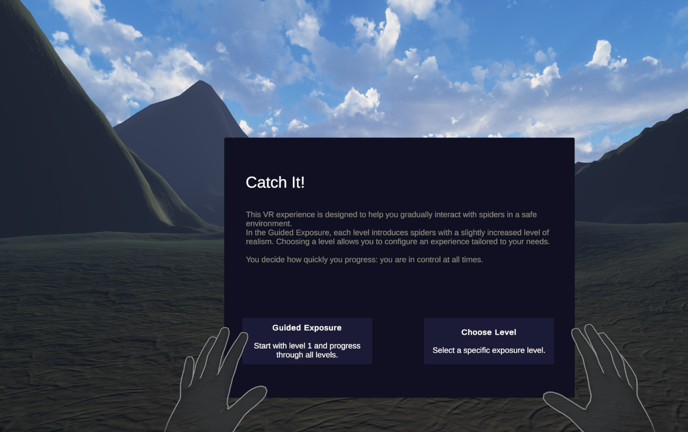
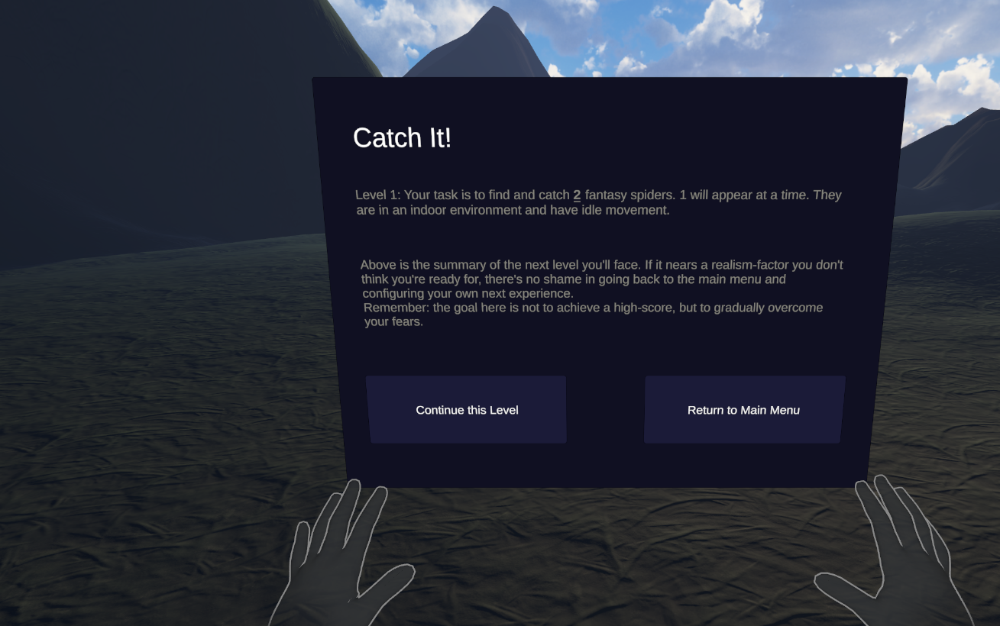
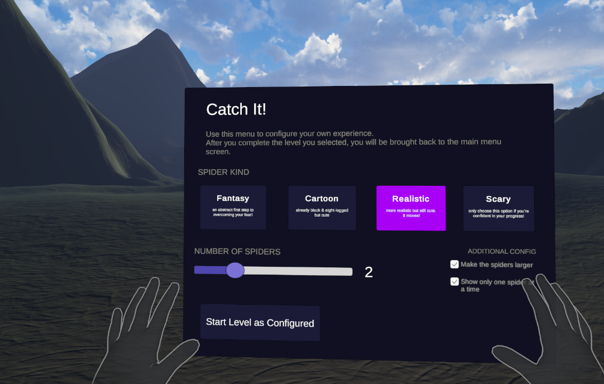

# 🕷️ catch-it

> A VR-based exposure therapy app to help people overcome their fear of spiders.

---

## About

catch-it is an XR application built for the **Meta Quest 3** using **hand tracking** (no controllers). Players must physically "touch" and collect virtual spiders. The difficulty increases gradually, guiding users from cartoonish spiders all the way to realistic close-contact interaction.

---

## Core Features

- 🖐 **Hand Tracking** — natural interaction, no controllers required
- 🎮 **Multiple Exposure Levels** — From Cartoon to Realistic to Scary

---

## Tech Stack

| Component | Technology |
|---|---|
| Engine | Unity 6 LTS |
| Headset | Meta Quest 3 |
| Interaction | Meta Hand Tracking SDK |
| Platform | Android (APK sideloaded via Meta Developer Hub) |

---

## Getting Started

```bash
git clone https://github.com/miranicad/catch-it.git
```

1. Open the project in **Unity Hub** (Unity 6 (specifically 6000.3.13f1))
2. Install the **Meta XR SDK** via Unity Package Manager
3. Enable **Developer Mode** on your Meta Quest headset
4. Build & deploy via **Meta Quest Developer Hub** or Unity's build settings

---

## Project Structure

```
catch-it/
├── Assets/
│   ├── Scenes/               # game scene (Catch It in Daylight)
│      └── Testing Levels/    # old game scenes from development & testing (Menu, Level 0–2)
│   ├── Scripts/              # Game logic & hand interaction
│      └── Testing Scripts/   # old scripts from development & testing; evolutions of these in parent folder
│   ├── Prefabs/              # Spider models; new prefabs made from imported assets with animation controllers where relevant
└── README.md
```

---

## Exposure Levels

All levels currently require touch to collect them, enabled by hand tracking

| Level | Spider Type | Links to images (to avoid jumpscares) |
|---|---|---|
| 1 | Fantasy | [spider_fantasy](docs/images/spider_fantasy.png) |
| 2 | Cartoon | [spider_cartoon](docs/images/spider_cartoon.png)  |
| 3 | Realistic | [spider_realistic](docs/images/spider_realistic.png)  |
| 4 | Scary | [spider_scary](docs/images/spider_scary.png)  |

The specifics of the levels are configurable via [LevelConfig](catch-it/Assets/Scripts/LevelConfig.cs). All spider models except for the cartoon one currently implement idle movement via simple animation controllers.
In this version of the prototype, they do not walk around, but remain static in place.

All spiders will spawn in an indoor environment. An outdoor environment was conceptualized, which is why the terrain is built as elaborately as it is, but ultimately the time during the project was not enough, due to lengthy bug fixing, issues with Unity and deployment of the Meta Quest, and various iterations and user testing. The indoor environment itself was enough to validate the concept and enable a good experience.

### Game Play Elaborations

The game starts simple: with an introduction screen. The language on the screens was deliberately chosen to support best therapy practices.



At the moment two play-through options are supported:

1. Starting a predefined sequence of levels


2. Creating your own custom level


Both options are supported in the [GameManager](catch-it/Assets/Scripts/GameManager.cs) where the code to initialize a level and handle all game state lives.

Starting any level leads to the level-start screen, where the user is informed of the upcoming level configuration and is allowed to stop the experience there, if they feel that the next level will exceed their comfort and trigger their fear. This feature was implemented based on direct user feedback, and is especially valuable for first-time players who might not understand the gameplay otherwise.

From here on, the game starts. To explore this, check-out and start the game, or use the executables appended in the project submission folder.

The following GIF shows an earlier prototype version, as played on Meta Quest 3, with difficulties given obstacles in the real environment.


A better quality version of the video can be found in the submission folder or on the [final presentation here](https://canva.link/y5xjc08ff6vjwcr).

---

## Team

Saskia Bosshard: <saskia.bosshard@students.fhnw.ch>

Tamira Leber: <tamira.leber@students.fhnw.ch>

Nadine Zbinden: <nadine.zbinden@students.fhnw.ch>

Developed as part of the **exr course at FHNW** (Spring 2026) by a team of 3 students.

---
